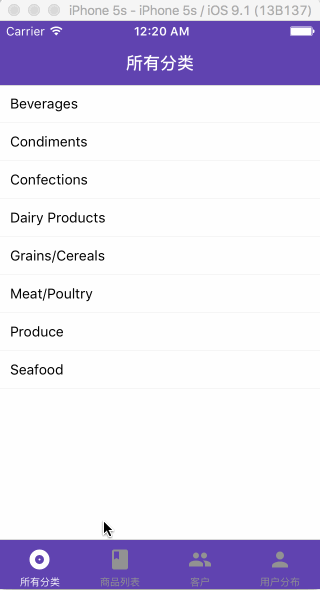

# NorthWind

- 使用loopback 提供 restful-api
- 使用 NorthWind 示例数据库为数据来源
- 使用 react-native 创建示例项目




## dir
```
.
├── LICENSE
├── README.md
├── nwa
│   ├── android
│   ├── app
│   ├── index.android.js
│   ├── index.ios.js
│   ├── index.js
│   ├── ios
│   ├── node_modules
│   └── package.json
└── nwa-api
    ├── README.md
    ├── client
    ├── common
    ├── node_modules
    ├── package.json
    └── server
```
- nwa react-native app
- nwa-api loopback service
